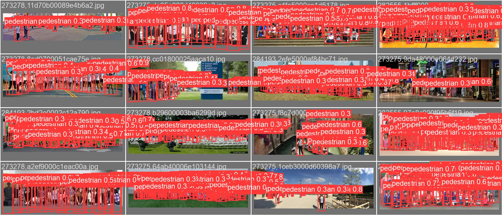

# ZiLO: A Lightweight, Stackable and Scalable Framework for Dense Pedestrian Detection

| Framework | Accuracy–Efficiency Trade-off |
|:---------:|:-----------------------------:|
| [Pipeline (PDF)](gitimg/pipeline.png) | [Pareto Curve (PDF)](gitimg/front1.jpg) |

## Introduction

**ZiLO** is a lightweight, stackable, and scalable pedestrian detection framework designed for edge deployment, built on top of [LeYOLO](https://arxiv.org/abs/2406.14239). It introduces three architectural improvements over the standard mobile inverted bottleneck, all integrated into a single unified block — `EfficientMobileNetBlock`:

1. **Adaptive Channel Expansion** — dynamically adjusts intermediate channel width based on input resolution, avoiding over-expansion in deep stages.
2. **Adaptive Attention** — automatically selects SE (Squeeze-and-Excitation) or ECA (Efficient Channel Attention) based on channel count, skipping attention entirely for very narrow layers.
3. **Residual Projection** — applies residual connections at every stride-1 layer, using a learned 1×1 projection when input/output channels differ.

This block replaces standard MobileNet-style blocks throughout both the backbone and neck, yielding strong accuracy–efficiency trade-offs on dense pedestrian benchmarks such as CrowdHuman, CityPersons, and WiderPerson.



---

## Installation

### Step 1 — Create a conda environment

```bash
conda create -n zilo python=3.10 -y
conda activate zilo
```

### Step 2 — Install dependencies

```bash
pip install huggingface_hub timm ultralytics "numpy<2"
```

### Step 3 — Set PYTHONPATH

Replace the path below with the absolute path to your local copy of this repo:

```bash
export PYTHONPATH=/path/to/ZiLO
```

### Step 4 — Install the package in editable mode

```bash
cd ZiLO
pip install -e .
```

---

## Quickstart

### Training

Edit `train.py` to set your dataset path and device, then run:

```bash
python train.py
```

The default config trains ZiLO-Base on COCO for 500 epochs with SGD on 2 GPUs. Key hyperparameters:

| Parameter | Default |
|-----------|---------|
| Model | ZiLO-Base (`zilobase.yaml`) |
| Dataset | COCO (`coco.yaml`) |
| Image size | 640 |
| Batch size | 32 (nbs=64) |
| Optimizer | SGD |
| lr0 / lrf | 0.01 / 0.01 |
| Epochs | 500 |
| Warmup epochs | 3 |

To train on a single GPU, change `device="0,1"` to `device="0"` in `train.py`.

### Validation / Testing

```python
from ultralytics import YOLO

model = YOLO("weights/ZiLOBase-coco.pt")  # load pre-trained weights
model.val(data="ultralytics/cfg/datasets/coco.yaml", imgsz=640, max_det=300)
```

To evaluate on a pedestrian benchmark, swap the dataset config:

```python
model.val(data="ultralytics/cfg/datasets/crowdhuman.yaml", imgsz=640, max_det=300)
```

### Inference

**On a single image:**

```python
from ultralytics import YOLO

model = YOLO("weights/ZiLOBase-coco.pt")
results = model("your_image.jpg")
results[0].show()
```

**On a video file:**

```python
results = model("your_video.mp4", save=True)
```

**Live from webcam:**

```bash
python inferencelocalweb.py
```

---

## Customization

### Configure your dataset

Dataset configs live in `ultralytics/cfg/datasets/`. The repo ships several pedestrian benchmarks out of the box:

| File | Dataset |
|------|---------|
| `crowdhuman.yaml` | CrowdHuman |
| `cityperson.yaml` | CityPersons |
| `widerperson.yaml` | WiderPerson |
| `caltech.yaml` | Caltech Pedestrian |
| `coco.yaml` | COCO (general) |

To add your own dataset, copy and edit one of these files. A minimal config looks like:

```yaml
# ultralytics/cfg/datasets/my_dataset.yaml
nc: 1
names: ['pedestrian']

path: /path/to/dataset       # root directory
train: /path/to/dataset/train
val:   /path/to/dataset/val
test:  /path/to/dataset/test  # optional
```

Then pass it to training or validation:

```python
model.train(data="ultralytics/cfg/datasets/my_dataset.yaml", ...)
model.val(data="ultralytics/cfg/datasets/my_dataset.yaml", ...)
```

### Load a different model variant

ZiLO ships two architecture YAMLs:

| File | Block | Description |
|------|-------|-------------|
| `ultralytics/cfg/cfg/zilobase.yaml` | `EfficientMobileNetBlock` | ZiLO-Base — full adaptive block |

To switch variants, change the YAML path in `train.py` or at load time:

```python
# Train ZiLO-Base (default)
model = YOLO("ultralytics/cfg/cfg/zilobase.yaml")

```

---

## Model Architecture

ZiLO uses `EfficientMobileNetBlock` as its core building block:

```
Input
  └─ [optional] PW expand  (mn_conv 1×1)
  └─ DW conv  (mn_conv k×k, depthwise)
  └─ [optional] Attention  (SE or ECA, channel-dependent)
  └─ PW project  (Conv2d 1×1 + BN)
  └─ Residual add  (identity or 1×1 projection)
Output
```

Attention policy (applied to intermediate channels `c_mid`):

| `c_mid` range | Attention |
|---------------|-----------|
| ≤ 8 | None |
| 8 < c_mid ≤ 24 | Squeeze-and-Excitation (SE) |
| > 24 | Efficient Channel Attention (ECA) |

---

## Acknowledgements

ZiLO is built on the [Ultralytics](https://github.com/ultralytics/ultralytics) framework and the [LeYOLO](https://github.com/LilianHollard/LeYOLO) backbone design. We thank Lilian and the Ultralytics team for their excellent open-source work.
