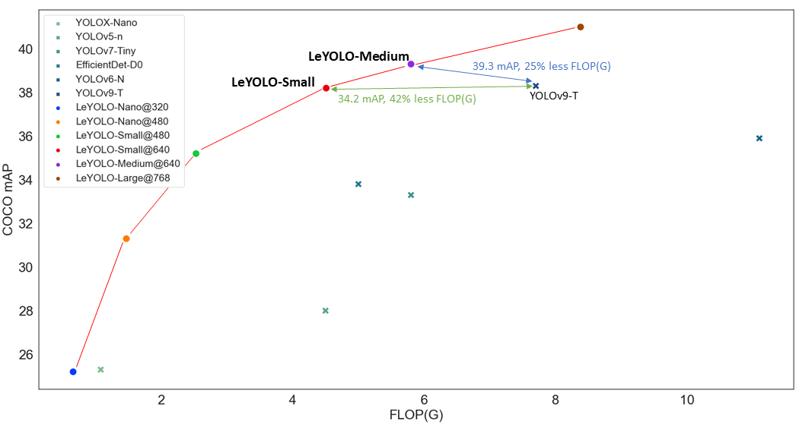

# ZiLO: Zero-shot Inverted-bottleneck Lightweight Object Detection



## Introduction

**ZiLO** is an efficient mobile object detection model built on top of the [LeYOLO](https://arxiv.org/abs/2406.14239) framework. It introduces three key improvements over the standard mobile inverted bottleneck:

1. **Adaptive Channel Expansion** — dynamically adjusts intermediate channel width based on input resolution, avoiding over-expansion in deep stages.
2. **Adaptive Attention** — automatically selects SE (Squeeze-and-Excitation) or ECA (Efficient Channel Attention) based on channel count, skipping attention entirely for very narrow layers.
3. **Residual Projection** — applies residual connections at every stride-1 layer, using a learned 1×1 projection when input/output channels differ.

These three components are integrated into a single block (`EfficientMobileNetBlock`) that replaces standard MobileNet-style blocks throughout the backbone and neck.

## Inference Results


## Pre-trained Weights

| Model | Dataset | mAP@50:95 | GFLOPs | Download |
|-------|---------|-----------|--------|----------|
| ZiLO-Base | COCO 2017 | — | — | [Google Drive](YOUR_GOOGLE_DRIVE_LINK_HERE) |

> Replace `YOUR_GOOGLE_DRIVE_LINK_HERE` with your actual link before publishing.

---

## Installation

### Step 1 — Create a conda environment

```bash
conda create -n zilo python=3.10 -y
conda activate zilo
```

### Step 2 — Install dependencies

```bash
pip install huggingface_hub timm ultralytics "numpy<2"
```

### Step 3 — Set PYTHONPATH

Replace the path below with the absolute path to your local copy of this repo:

```bash
export PYTHONPATH=/path/to/ZiLO-clean
```

For example, on a Featurize server:

```bash
export PYTHONPATH=/home/featurize/work/ZiLO-clean
```

### Step 4 — Install the package in editable mode

```bash
cd ZiLO-clean
pip install -e .
```

---

## Quickstart

### Run inference on an image

```python
from ultralytics import YOLO

model = YOLO("weights/zilobase.pt")  # load pre-trained weights
results = model("your_image.jpg")
results[0].show()
```

### Run inference on a video

```bash
python inferencevideo.py
```

### Validate on COCO

```python
from ultralytics import YOLO

model = YOLO("weights/zilobase.pt")
model.val(data="ultralytics/cfg/datasets/coco.yaml", imgsz=640, max_det=300)
```

---

## Training from Scratch

Edit `train.py` to set your dataset path and device, then run:

```bash
python train.py
```

The default config trains ZiLO-Base on COCO for 500 epochs with SGD on 2 GPUs. Key hyperparameters:

| Parameter | Value |
|-----------|-------|
| Image size | 640 |
| Batch size | 32 (nbs=64) |
| Optimizer | SGD |
| lr0 / lrf | 0.01 / 0.01 |
| Epochs | 500 |
| Warmup epochs | 3 |

To train on a single GPU, change `device="0,1"` to `device="0"` in `train.py`.

---

## Model Architecture

ZiLO uses an `EfficientMobileNetBlock` as its core building block:

```
Input
  └─ [optional] PW expand  (mn_conv 1×1)
  └─ DW conv  (mn_conv k×k, depthwise)
  └─ [optional] Attention  (SE or ECA, channel-dependent)
  └─ PW project  (Conv2d 1×1 + BN)
  └─ Residual add  (identity or 1×1 projection)
Output
```

Attention policy (applied to intermediate channels `c_mid`):
- `c_mid ≤ 8` → no attention
- `8 < c_mid ≤ 24` → Squeeze-and-Excitation (SE)
- `c_mid > 24` → Efficient Channel Attention (ECA)

---

## Citation

If you use ZiLO or find it helpful, please cite the original LeYOLO paper:

```bibtex
@article{hollard2024leyolo,
  title={LeYOLO: New Scalable and Efficient CNN Architecture for Object Detection},
  author={Hollard, Lilian and Lemaire, Ludovic},
  journal={arXiv preprint arXiv:2406.14239},
  year={2024}
}
```

## Acknowledgements

ZiLO is built on the [Ultralytics](https://github.com/ultralytics/ultralytics) framework and the [LeYOLO](https://github.com/LilianHollard/LeYOLO) backbone design. We thank the Ultralytics team for their excellent open-source work.
